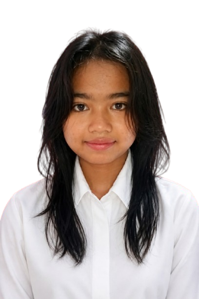

<!DOCTYPE html>
<html lang="id">
<head>
    <meta charset="UTF-8">
    <meta name="viewport" content="width=device-width, initial-scale=1.0">
    <title>Portofolio Anra</title>
    <link href="https://fonts.googleapis.com/css2?family=Montserrat:wght@400;700&display=swap" rel="stylesheet">
    <link rel="shortcut icon" href="foto3.png" type="image/x-icon">
    
</head>
<body>

    <section class="hero-container">
        

            <h1>Halo, Saya Antika Rahayu Shaqila</h1>
            
            

                Seorang lulusan <strong>SMK NEGERI 4 KUNINGAN</strong> yang disiplin dan berorientasi pada detail. 
                Memiliki pengalaman dalam bekerja dalam tim.
            

            
            

                Saya berkomitmen untuk memberikan kontribusi positif bagi perusahaan melalui keterampilan 
                manajemen waktu yang baik serta kemauan untuk terus belajar hal baru.
            

            
            

            <a href="https://mail.google.com/mail/?view=cm&fs=1&to=antikarash58@gmail.com" class="btn-cv">Kirim Email</a>
             <a href="https://drive.google.com/file/d/1-KElW5CXP4TgGOclFxK6niMsfvj1UHCe/view?usp=cv Antika Rahayu Shaqila.pdf" target="_blank" class="btn-                       cv">Lihat / Download CV</a>
           

        

        

            

            

                
            

            

        

    </section>

    

        <a href="profil.html" class="icon-item" title="Tentang Saya">👤</a>
        
        <a href="pendidikan.html" class="icon-item" title="Pendidikan">🎓</a>
        
        <a href="pengalaman.html" class="icon-item" title="Pengalaman Kerja">💼</a>
        <a href="keahlian.html" class="icon-item" title="Keahlian">🛠️</a>
        <a href="kontak.html" class="icon-item" title="Kontak">📞</a>
    

    <footer class="footer-copyright">
    
&copy; 2026 Anra. All Rights Reserved.

</footer>
</body>
</html>

<!DOCTYPE html>
<html lang="id">
<head>
    <meta charset="UTF-8">
    <meta name="viewport" content="width=device-width, initial-scale=1.0">
    <title>Profil Lengkap - [Nama Anda]</title>
    <link href="https://fonts.googleapis.com/css2?family=Montserrat:wght@400;700&display=swap" rel="stylesheet">
    
</head>
<body>

    

        <header>
            <h1>Tentang Saya</h1>
            
Mengenal lebih dekat perjalanan profesional dan pribadi saya.

        </header>

        

            <h2>👤 Biografi Singkat</h2>
            

                Saya adalah seorang lulusan SMK NEGERI 4 KUNINGAN yang memiliki ketertarikan besar dalam dunia berbagai bidang operasional dan industri kreatif. 
                Lahir dan besar di Cirebon, Jawa Barat, saya terbiasa bekerja keras dan menghargai nilai-nilai kejujuran dalam lingkungan kerja.
            

        

        

            <h2>🎨 Hobi & Ketertarikan</h2>
            
Di waktu senggang, saya senang mengeksplorasi kreativitas dan menjaga keseimbangan hidup melalui:

            <ul class="hobi-list">
                <li class="hobi-item">Membaca Novel </li>
                <li class="hobi-item">Berimajinasi </li>
                <li class="hobi-item">Olahraga Sepeda</li>
                <li class="hobi-item">Membuat prakarya</li>
            </ul>
        

        

            <h2>🚀 Motivasi Kerja</h2>
            

            Bekerja bukan hanya tentang menyelesaikan tugas, tetapi tentang memberikan nilai tambah dan solusi di setiap kesempatan
            

        

        

            <a href="portofolio.html" class="back-btn">← Kembali ke Halaman Utama</a>
        

    

     <footer class="footer-copyright">
    
&copy; 2026 Anra. All Rights Reserved.

</footer>

</body>
</html>

<!DOCTYPE html>
<html lang="id">
<head>
    <meta charset="UTF-8">
    <meta name="viewport" content="width=device-width, initial-scale=1.0">
    <title>Profil Lengkap - [Nama Anda]</title>
    <link href="https://fonts.googleapis.com/css2?family=Montserrat:wght@400;700&display=swap" rel="stylesheet">
    
</head>
<body>

    

        <header>
            <h1>Tentang Pendidikan</h1>
            
Mengenal lebih dekat perjalanan profesional dan pribadi saya.

        </header>

        

            <h2>👩‍🎓SD Negeri 1 TanjunganomLulus-2020</h2>
            

              Nama	                    :	SD NEGERI 1 TANJUNG ANOM KECAMATAN PASALEMAN 
 	          NPSN	                    :	20215473 
 	          Alamat	                :	Jl. Raya Tanjunganom Kec. Pasaleman Kab. Cirebon 
 	          Desa/Kelurahan	        :	TANJUNG ANOM 
              Kecamatan/Kota (LN)	    :	KEC. PASALEMAN 
              Kab.-Kota/Negara (LN)	    :	KAB. CIREBON 
 	          Propinsi/Luar Negeri (LN)	:	PROV. JAWA BARAT 
 	          Status Sekolah	        :	NEGERI 
              Bentuk Pendidikan	        :	SD 
 	          Jenjang Pendidikan	    :	DIKDAS  
            

           

             <iframe src="https://www.google.com/maps/embed?pb=!1m18!1m12!1m3!1d3960.560376761568!2d108.7559303748228!3d-6.943024893057075!2m3!1f0!2f0!3f0!3m2!1i1024!2i768!4f13.1!3m3!1m2!1s0x2e6f090aeb9566a3%3A0x34c206c48ef7d2d2!2sSDN%201%20Tanjung%20Anom!5e0!3m2!1sen!2sus!4v1778470558539!5m2!1sen!2sus" width="200" height="200" style="border:0;" allowfullscreen="" loading="lazy" referrerpolicy="no-referrer-when-downgrade"></iframe>
             

            
        

        

            <h2>👩‍🎓SMP AN-NUUR PASALEMANLulus-2023</h2>
            

 	         Alamat	                    :	Jl. Raya Pasaleman No. 2 
             NPSN	                    :		20214810 
 	         Desa/Kelurahan          	:	CIKEUSIK 
 	         Kecamatan/Kota (LN)	    :	PASALEMAN 
 	         Kab.-Kota/Negara (LN)	    :	KAB. CIREBON 
 	         Propinsi/Luar Negeri (LN)	:	PROV. JAWA BARAT 
 	         Status Sekolah	            :	SWASTA 
 	         Bentuk Pendidikan      	:	SMP 
 	         Jenjang Pendidikan     	:	DIKDAS
            

           

           <iframe src="https://www.google.com/maps/embed?pb=!1m18!1m12!1m3!1d3960.7340147347854!2d108.72667707781096!3d-6.9223665752276275!2m3!1f0!2f0!3f0!3m2!1i1024!2i768!4f13.1!3m3!1m2!1s0x2e6f093b34325409%3A0x2147f8eb4e8fb230!2sSMP%20AN-NUUR%20PASALEMAN!5e0!3m2!1sen!2sus!4v1778472318866!5m2!1sen!2sus" width="200" height="200" style="border:0;" allowfullscreen="" loading="lazy" referrerpolicy="no-referrer-when-downgrade"></iframe>
           

            
        
  
         

            <h2>👩‍🎓SMK NEGERI 4 KUNINGANLulus-2026</h2>
            

 	         Alamat	                    :	JL. RAYA CIKEUSIK - CIDAHU 
             NPSN	                    :	20246369 
 	         Desa/Kelurahan          	:	CIKEUSIK 
 	         Kecamatan/Kota (LN)	    :	KEC. CIDAHU 
 	         Kab.-Kota/Negara (LN)	    :	KAB. KUNINGAN 
 	         Propinsi/Luar Negeri (LN)	:	PROV. JAWA BARAT 
 	         Status Sekolah	            :	NEGERI 
 	         Bentuk Pendidikan      	:	SMK 
 	         Jenjang Pendidikan     	:	DIKMEN
            

           

      <iframe src="https://www.google.com/maps/embed?pb=!1m18!1m12!1m3!1d3960.4519815934177!2d108.68152037482288!3d-6.955890093044438!2m3!1f0!2f0!3f0!3m2!1i1024!2i768!4f13.1!3m3!1m2!1s0x2e6f0e97e9beddcb%3A0x2fd17d5f9eaf9d66!2sSMK%20Negeri%204%20Kuningan!5e0!3m2!1sen!2sus!4v1778470791876!5m2!1sen!2sus" width="200" height="200" style="border:0;" allowfullscreen="" loading="lazy" referrerpolicy="no-referrer-when-downgrade"></iframe>
     

            
        

        

            <a href="portofolio.html" class="back-btn">← Kembali ke Halaman Utama</a>
        

    

     <footer class="footer-copyright">
    
&copy; 2026 Anra. All Rights Reserved.

</footer>
</body>
</html>

<!DOCTYPE html>
<html lang="id">
<head>
    <meta charset="UTF-8">
    <meta name="viewport" content="width=device-width, initial-scale=1.0">
    <title>Profil Lengkap - [Nama Anda]</title>
    <link href="https://fonts.googleapis.com/css2?family=Montserrat:wght@400;700&display=swap" rel="stylesheet">
    
</head>
<body>

   

    <header>
        <h1>Pengalaman</h1>
        
Mengenal lebih dekat perjalanan profesional dan pribadi saya.

    </header>

    

        

            <h2>Prisma Digital  Printing & Advertising PKL Selesai</h2>
            

                📍 Jl. Pangeran Sutajaya, Pabuaran Lor, Cirebon 
                📅 <strong>Periode:</strong>27juli-29November 2023
            

            
            <h4 style="color: #0056b3; margin-top: 15px; margin-bottom: 5px;">Tugas & Tanggung Jawab:</h4>
            <ul style="margin-left: 20px; font-size: 0.95rem; color: #333;">
                <li>Mendesain media promosi (Banner) menggunakan Canva.</li>
                <li>Melakukan finishing: pemotongan, pengeleman, ngepres mata ayam (bolongan),  melipat, dan menggulung spanduk.</li>
                <li>Menjaga kebersihan dan kerapihan area operasional toko.</li>
            </ul>
        

        
        

           <iframe src="https://www.google.com/maps/embed?pb=!1m18!1m12!1m3!1d3960.894453819258!2d108.71840017482243!3d-6.903223893096104!2m3!1f0!2f0!3f0!3m2!1i1024!2i768!4f13.1!3m3!1m2!1s0x2e6f08b64e25e3ab%3A0xd545ed2e3d703501!2sPrisma%20Digital%20Printing%20%26%20Advertising%20Pabuaran%20(CV.%20Prisma%20Masagi)!5e0!3m2!1sen!2sus!4v1778477066753!5m2!1sen!2sus" width="200" height="200" style="border:0;" allowfullscreen="" loading="lazy" referrerpolicy="no-referrer-when-downgrade"></iframe>
        

    

    

        

            <h2>Toko Serba 35 Ribu Kerja Selesai</h2>
            

                📍 Jl. Jatiseeng Kidul, Jatiseeng, Cirebon 
                📅 <strong>Periode:</strong> 6-20 Februari 2026
            

            
            <h4 style="color: #0056b3; margin-top: 15px; margin-bottom: 5px;">Tugas & Tanggung Jawab:</h4>
            <ul style="margin-left: 20px; font-size: 0.95rem; color: #333;">
                <li>Visual Merchandising Assistance: Membantu penataan pakaian  di area pajang agar terlihat menarik bagi konsumen.</li>
                <li>Melakukan penataan barang (*display*) agar rapi dan menarik.</li>
                <li>Menjaga kebersihan area toko demi kenyamanan pengunjung.</li>
            </ul>
        

        

            <iframe src="https://www.google.com/maps/embed?pb=!1m18!1m12!1m3!1d330.0635719421733!2d108.74059412710756!3d-6.906710465235289!2m3!1f0!2f0!3f0!3m2!1i1024!2i768!4f13.1!3m3!1m2!1s0x2e6f09a0c5f20b23%3A0x4e700e8d1eb2dc1d!2sToko%20Serba%2035%20Ribu!5e0!3m2!1sen!2sus!4v1778475921862!5m2!1sen!2sus" width="200" height="200" style="border:0;" allowfullscreen="" loading="lazy" referrerpolicy="no-referrer-when-downgrade"></iframe>
        

    

      

            <a href="portofolio.html" class="back-btn">← Kembali ke Halaman Utama</a>
        

    
     <footer class="footer-copyright">
    
&copy; 2026 Anra. All Rights Reserved.

</footer>

</body>
</html>

<!DOCTYPE html>
<html lang="id">
<head>
    <meta charset="UTF-8">
    <meta name="viewport" content="width=device-width, initial-scale=1.0">
    <title>Keahlian - Portofolio Anra</title>
    <link href="https://fonts.googleapis.com/css2?family=Montserrat:wght@400;700&display=swap" rel="stylesheet">
    
</head>
<body>

    

        <header>
            <h1>Keahlian Saya</h1>
            
Kemampuan teknis yang saya kuasai.

        </header>

        

            
🤝

            

                <h3>Kerja Sama Tim</h3>
                
Memiliki kemampuan komunikasi yang baik dalam lingkungan kerja.

                

                    

                

            

        

        

         
⏳

         

          <h3>Manajemen Tekanan</h3>
          
Mampu tetap tenang dan produktif dalam menyelesaikan tugas meskipun di bawah tekanan atau situasi kerja yang sibuk.

          

            

         

         

        

        
        

         
🎯

        

        <h3>Etos Kerja & Kedisiplinan</h3>
        
Berkomitmen tinggi pada kejujuran, ketepatan waktu, serta selalu berusaha memberikan hasil terbaik dalam setiap tanggung jawab.

        

            

        

       

      

      

            <a href="portofolio.html" class="back-btn">← Kembali ke Halaman Utama</a>
        

    

      <footer class="footer-copyright">
    
&copy; 2026 Anra. All Rights Reserved.

</footer>

</body>
</html>
<!DOCTYPE html>
<html lang="id">
<head>
    <meta charset="UTF-8">
    <meta name="viewport" content="width=device-width, initial-scale=1.0">
    <title>Kontak - Hubungi Saya</title>
    <link href="https://fonts.googleapis.com/css2?family=Montserrat:wght@400;700&display=swap" rel="stylesheet">
    
</head>
<body>

    

        <header>
            <h1>Kontak</h1>
            
Silakan hubungi saya melalui saluran di bawah ini.

        </header>

        

            

                <h2>Mari Berdiskusi!</h2>
                
Saya terbuka untuk peluang kerja, magang, atau sekadar bertukar ide.

                
                <ul class="contact-list">
                    <li>
                        🟢 
                        <strong>WhatsApp:</strong> 
                        <a href="https://wa.me/83824484713" target="_blank">+62 83824484713</a>
                    </li>
                    <li>
                        📧 
                        <strong>Email:</strong> 
                        <a href="mailto:antikarash58@gmail.com">antikarash58@gmail.com</a>
                    </li>
                    <li>
                        📍 
                        <strong>Domisili:</strong> Cirebon, Jawa Barat
                    </li>
                </ul>
            

            

                📱
            

        

    

   

            <a href="portofolio.html" class="back-btn">← Kembali ke Halaman Utama</a>
        

     <footer class="footer-copyright">
    
&copy; 2026 Anra. All Rights Reserved.

</footer>
</body>
</html>
